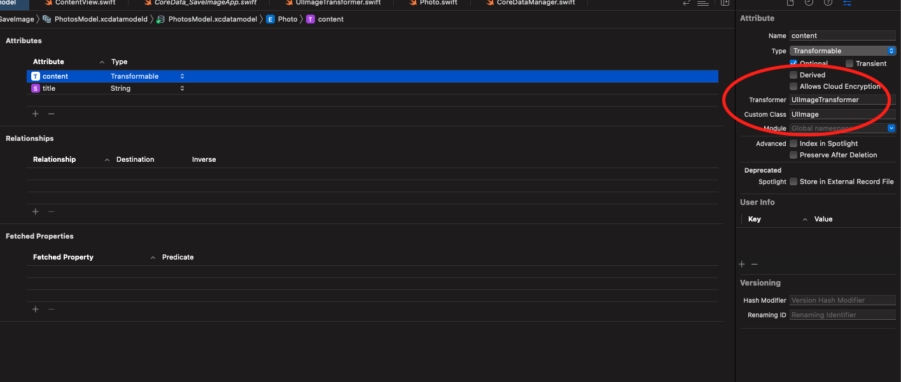

# Save Image



### Preparation

- Custom Class
- Transformable Field

### Custom Class

- Photo

```swift
import Foundation
import UIKit
import CoreData

@objc(Photo)
class Photo: NSManagedObject {
    
    @nonobjc public class func fetchRequest() -> NSFetchRequest<Photo> {
        return NSFetchRequest<Photo>(entityName: "Photo")
    }
    
    @NSManaged public var content: UIImage?
    @NSManaged public var title: String?
    
}

extension Photo: Identifiable {
    
}

```

### Transformer

```swift
import Foundation
import UIKit

class UIImageTransformer: ValueTransformer {
    
    override func transformedValue(_ value: Any?) -> Any? {
        guard let image = value as? UIImage else { return nil }
        do {
            let data = try NSKeyedArchiver.archivedData(withRootObject: image, requiringSecureCoding: true)
            return data
        } catch {
            return nil
        }
    }
    
    override func reverseTransformedValue(_ value: Any?) -> Any? {
        guard let data = value as? Data else { return nil }
        do {
            let image = try NSKeyedUnarchiver.unarchivedObject(ofClass: UIImage.self, from: data)
            return image
        } catch {
            return nil
        }
    }
    
}
```

### CoreDataManager

```swift
import Foundation
import CoreData

class CoreDataManager {
    
    let persistentContainer: NSPersistentContainer
    static let shared: CoreDataManager = CoreDataManager()
    
    private init() {
        
        ValueTransformer.setValueTransformer(UIImageTransformer(), forName: NSValueTransformerName("UIImageTransformer"))
        
        self.persistentContainer = NSPersistentContainer(name: "PhotosModel")
        self.persistentContainer.loadPersistentStores { desc, error in
            if let error {
                fatalError(error.localizedDescription)
            }
        }
    }
    
}
```

### ContentView

```swift
import SwiftUI

struct ContentView: View {
    
    @State var image: UIImage?
    
    var body: some View {
        VStack {
            Button("Download Image") {
                let url = URL(string: "https://i.pinimg.com/originals/d6/e4/0c/d6e40c3cefb1ca1f59134f3c89469e97.jpg")!
                URLSession.shared.dataTask(with: url) { data, _, error in
                    guard let data, error == nil else {
                        return
                    }
                    let context = CoreDataManager.shared.persistentContainer.viewContext
                    let photo = Photo(context: context)
                    photo.title = "Random Photo"
                    photo.content = UIImage(data: data)
                    try? context.save()
                    
                    DispatchQueue.main.async {
                        self.image = photo.content
                    }
                }
                .resume()
            }
            
            if let image {
                Image(uiImage: image)
            }
            
        }
    }
}

struct ContentView_Previews: PreviewProvider {
    static var previews: some View {
        ContentView()
    }
}
```
# CoreData-SaveImage
